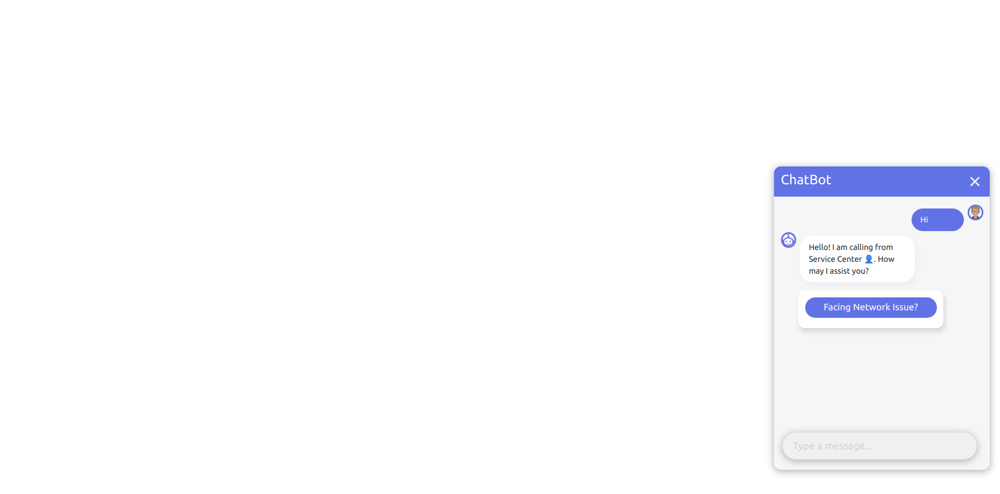
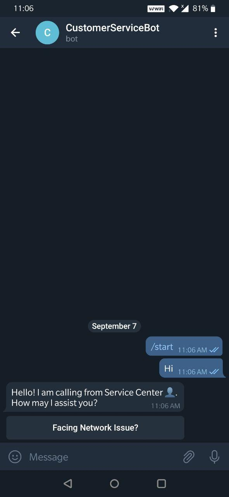
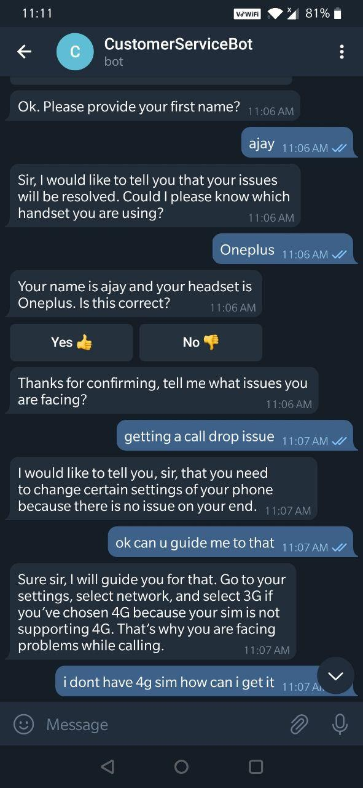
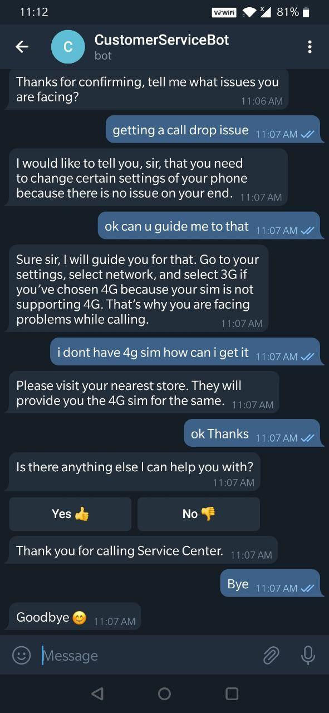

# Customer-Service-Bot
A customer service bot using Rasa framework.

## Screens
UI
 !
Telegram
   !

  
   
  

## Features
- User can search for the queries regarding network issues.
- Support for Interactive elements of Telegram.

## Rasa Components Used
- [Transformer Embedding Dialogue Policy (TEDP)](https://rasa.com/docs/rasa/core/policies/#ted-policy)
- [Retrieval Actions](https://rasa.com/docs/rasa/core/retrieval-actions/#retrieval-actions)
- [DIET Classifier](https://rasa.com/docs/rasa/nlu/components/#dietclassifier)

## Prerequisites
- Rasa Framework, check the details [here](https://rasa.com/docs/rasa/user-guide/installation/)

## How to use
- Clone the repo
- If you love working in virtual env then create one env
- Run pip install -r requirements.txt
- then open the terminal in the project directory and run the below commands
  - > rasa train
  - Once the bot has been trained, run the bot using the below commands
  - > rasa run actions
  - > rasa run -m models --enable-api --cors "*" --debug
  - > python app.py for Ui hosted with Flask api.
